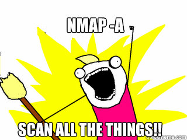

<!--
*** This readme format is based of https://github.com/othneildrew/Best-README-Template.
*** If you liked it, please give it a star.
-->

<!-- PROJECT SHIELDS -->

[![Contributors][contributors-shield]][contributors-url]
[![Forks][forks-shield]][forks-url]
[![Stargazers][stars-shield]][stars-url]
[![Issues][issues-shield]][issues-url]
[![MIT License][license-shield]][license-url]

<!-- PROJECT LOGO -->
 

  

  <h1 align="center">Nmap .NET</h1>

  

    🕵️ The Nmap CLI client for c# developers!
     
    <a href="https://github.com/christoskaltsas/nmap-dotnet"><strong>Explore the docs »</strong></a>
     
     
    <a href="https://github.com/christoskaltsas/nmap-dotnet">View Demo</a>
    ·
    <a href="https://github.com/christoskaltsas/nmap-dotnet/issues">Report Bug</a>
    ·
    <a href="https://github.com/christoskaltsas/nmap-dotnet/issues">Request Feature</a>
  

<!-- TABLE OF CONTENTS -->

  
Table of Contents

  <ol>
    <li>
      <a href="#-documentation">📚 Documentation</a>
    </li>
    <li>
      <a href="#-installation">🔧 Installation</a>
    </li>
    <li>
      <a href="#-examples">🧪 Examples</a>
    </li>
    <li>
      <a href="#-roadmap">🛣️ Roadmap</a>
    </li>
    <li>
      <a href="#-acknowledgments">🌟 Acknowledgments</a>
    </li>
  </ol>

<!-- Documentation -->

## 📚 Documentation

TBD

<!-- Installation -->

## 🔧 Installation

TBD

<!-- Examples -->

## 🧪 Examples

TBD

<!-- Roadmap -->

## 🛣️ Roadmap

TBD

## 🌟 Acknowledgments

TBD

<!-- MARKDOWN LINKS & IMAGES -->
<!-- https://www.markdownguide.org/basic-syntax/#reference-style-links -->

[contributors-shield]: https://img.shields.io/github/contributors/christoskaltsas/nmap-dotnet.svg?style=for-the-badge
[contributors-url]: https://github.com/christoskaltsas/nmap-dotnet/graphs/contributors
[forks-shield]: https://img.shields.io/github/forks/christoskaltsas/nmap-dotnet.svg?style=for-the-badge
[forks-url]: https://github.com/christoskaltsas/nmap-dotnet/network/members
[stars-shield]: https://img.shields.io/github/stars/christoskaltsas/nmap-dotnet.svg?style=for-the-badge
[stars-url]: https://github.com/christoskaltsas/nmap-dotnet/stargazers
[issues-shield]: https://img.shields.io/github/issues/christoskaltsas/nmap-dotnet.svg?style=for-the-badge
[issues-url]: https://github.com/christoskaltsas/nmap-dotnet/issues
[license-shield]: https://img.shields.io/github/license/christoskaltsas/nmap-dotnet.svg?style=for-the-badge
[license-url]: https://github.com/christoskaltsas/nmap-dotnet/blob/master/LICENSE.txt
[linkedin-shield]: https://img.shields.io/badge/-LinkedIn-black.svg?style=for-the-badge&logo=linkedin&colorB=555
